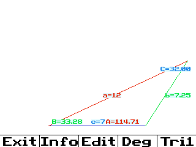
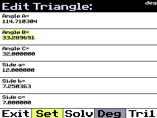
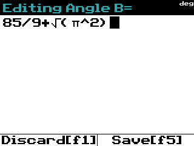
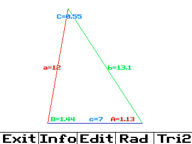

# TriSolve

TriSolve is a program designed to run on a TI-84 Plus CE calculator. It allows you to input a combination of sides and angles of a triangle and uses that information to solve for the other sides and angles. The program will then display the triangle, and if the provided information allows it to solve for two triangles, it will show both.

**Version 1.0.7**

## Features

- Solve triangles using different sets of known values.
- Verify if a triangle is real based on side lengths and angles.
- Display the calculated sides, angles, perimeter, and area of the triangle.
- Support for both degrees and radians.

## Usage

1. **Start the Program**: When you start the program, it will display a preset triangle of the developer's choice.
2. **Main Screen**: The bottom of the screen will have buttons for:
    - **Exit [y=]**: Quit the program.
    - **Info [window]**: Display credits and the perimeter and area of Triangle 1, and if it exists, Triangle 2.
    - **Edit [Zoom]**: Enter the edit mode to modify sides and angles.
    - **Deg [trace]**: Toggle between degrees and radians.
    - **Tr1 [graph]**: Toggle between displaying Triangle 1 and, if it exists, Triangle 2.

3. **Edit Mode**:
    - Use the arrow keys to cycle through the sides and angles.
    - Click **Set [window]** to edit a selected value.
    - Click **Solve [Zoom]** to solve the triangle with the provided values.

4. **Exit**: You can exit the program at any time by pressing the **Exit [y=]** button.

## Example

Here is an example of how to use TriSolve to solve a triangle with Angle-Side-Side (ASS):

```c
#include "trianglesolver.h"

int main() {
    double sideA = 5.0;
    double sideB = 7.0;
    double angleA = 30.0;
    bool isTri2;
    double Tri1SideA, Tri1SideB, Tri1SideC, Tri1AngleA, Tri1AngleB, Tri1AngleC;
    double Tri2SideA, Tri2SideB, Tri2SideC, Tri2AngleA, Tri2AngleB, Tri2AngleC;

    if (attemptToSolveTri(sideA, sideB, 0, angleA, 0, 0, &isTri2, &Tri1SideA, &Tri1SideB, &Tri1SideC, &Tri1AngleA, &Tri1AngleB, &Tri1AngleC, &Tri2SideA, &Tri2SideB, &Tri2SideC, &Tri2AngleA, &Tri2AngleB, &Tri2AngleC)) {
        printf("Triangle 1:\n");
        printf("Sides: A = %f, B = %f, C = %f\n", Tri1SideA, Tri1SideB, Tri1SideC);
        printf("Angles: A = %f, B = %f, C = %f\n", Tri1AngleA, Tri1AngleB, Tri1AngleC);

        if (isTri2) {
             printf("Triangle 2:\n");
             printf("Sides: A = %f, B = %f, C = %f\n", Tri2SideA, Tri2SideB, Tri2SideC);
             printf("Angles: A = %f, B = %f, C = %f\n", Tri2AngleA, Tri2AngleB, Tri2AngleC);
        }
    } else {
        printf("The triangle is not real.\n");
    }

    return 0;
}
```

**Note:** While this program is primarily designed to run on a TI-84 Plus CE calculator, it can also be used as a library for other projects. This is not the intended purpose, but it is a helpful byproduct of the program.

## Screenshots

*The main menu with the preset triangle and the buttons at the bottom.*


*Edit screen where you can modify sides and angles.*


*Editing a specific value in the edit mode.*


*The main menu in radian mode, displaying Triangle 2.*

## Credits

Developed by Isaac Ruiz Kahle  
Uses Tinyexpr for parsing mathematical expressions  
Special thanks to the CE Toolchain developers for their help and making this possible.

## License

This project is licensed under the MIT License. See the LICENSE file for details.

## Note

While this program is primarily designed to run on a TI-84 Plus CE calculator, it can be used as a library for other projects. However, this is not the intended purpose, but it is completely allowed by the license.

## Contact

For any questions or inquiries, please contact kastorsak@gmail.com
